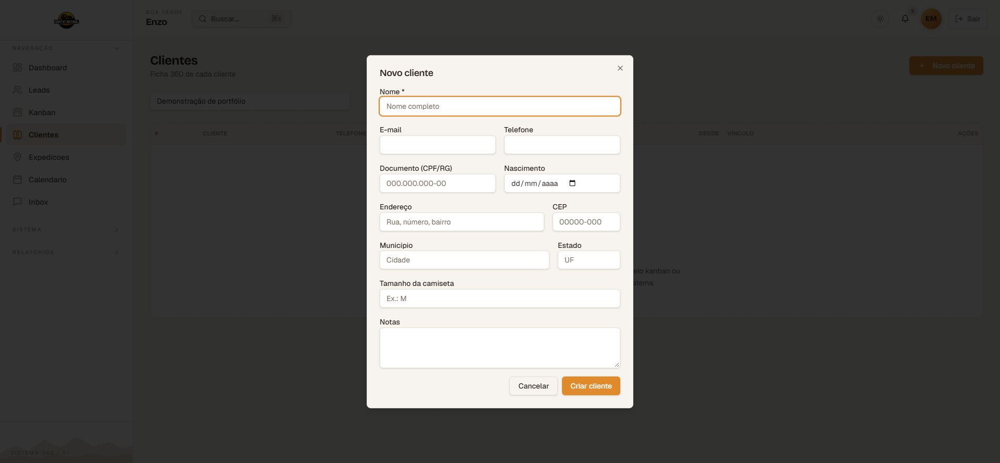
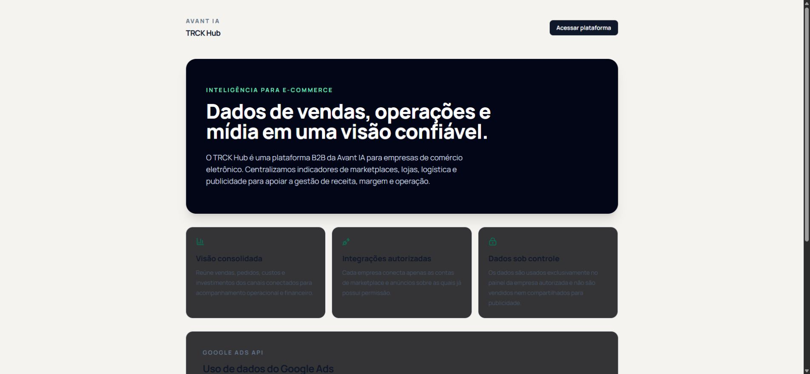
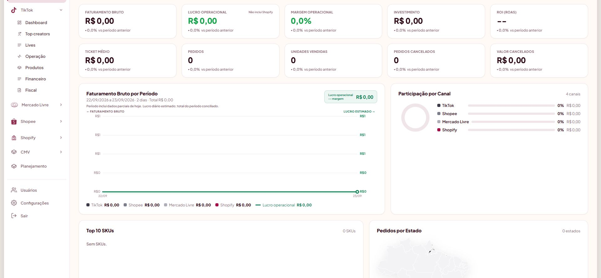

# Enzo Tortelli Mendes

**Desenvolvedor Full Stack | IA aplicada, integrações bancárias e sistemas de negócio**

Desenvolvo aplicações web que conectam atendimento, vendas, operações e dados. Minha experiência inclui produtos criados do zero e a evolução de sistemas existentes, do frontend às APIs, bancos de dados e automações.

**Idiomas:** português nativo e inglês fluente.

[Projetos principais](#projetos-principais) | [Entregas técnicas](#entregas-técnicas) | [IA, bancos e integrações](#ia-bancos-e-integrações) | [Contato](#contato)

## Projetos principais

Projetos profissionais desenvolvidos na empresa. Os estudos de caso apresentam minha participação e as funcionalidades dos sistemas; o código-fonte privado e os dados dos clientes não são publicados aqui.

### [Habitat Natural](projects/habitat-natural/README.md)

**Minha atuação: desenvolvimento do zero.**

Plataforma de gestão de viagens e expedições que conecta captação de leads, CRM, reservas, listas de espera, contratos e processos financeiros.

- **Bancos e pagamentos:** integrações com Bradesco Pix, Sicredi e Asaas.
- **Operação conectada:** assinaturas com ZapSign, e-mails com Resend e comunicação por WhatsApp.
- **Dados e processamento:** PostgreSQL, Supabase, Drizzle ORM, Redis e BullMQ; reservas com controle transacional e filas de notificações.
- **Aplicação:** TypeScript, Next.js e Fastify.

[Ver estudo de caso e captura da interface](projects/habitat-natural/README.md)

### [Belas Garden](projects/belas-garden/README.md)

**Minha atuação: continuidade e evolução de um projeto já em desenvolvimento.**

CRM multicanal com a assistente de vendas Bela, integrando atendimento, informações da loja e inteligência artificial.

- **IA aplicada:** OpenAI, central de conhecimento e ambiente de teste de conversas antes da publicação.
- **Atendimento e e-commerce:** WhatsApp, Evolution API, Instagram/Meta e Nuvemshop.
- **Dados:** Supabase/PostgreSQL e Redis.
- **Aplicação:** Next.js, React, TypeScript, Python e FastAPI.

[Ver estudo de caso e central de IA](projects/belas-garden/README.md)

### [TRCK Hub](projects/trck-hub/README.md)

**Minha atuação: desenvolvimento do zero.**

Central de operações de e-commerce que reúne pedidos, estoque e dados financeiros de diferentes canais, com conciliação entre marketplaces e ERP.

- **Marketplaces e lojas:** Mercado Livre, Shopee, Amazon, TikTok Shop, Magalu, Netshoes e Tray.
- **ERP e análise:** Tiny ERP; acompanhamento de faturamento, taxas, custos, margem e cancelamentos.
- **Dados e sincronização:** PostgreSQL, Supabase e rotinas de sincronização entre serviços.
- **Aplicação:** TypeScript, React, Vite e Node.js.

[Ver estudo de caso e apresentação pública](projects/trck-hub/README.md)

### [Popozuda Hub](projects/popozuda-hub/README.md)

**Minha atuação: desenvolvimento do zero.**

Plataforma de análise de e-commerce com visão consolidada de vendas, taxas, reembolsos, estoque, custos e margens por canal.

- **Marketplaces e lojas:** TikTok Shop, Mercado Livre, Shopee e Shopify.
- **ERP e pagamentos:** Bling e Appmax.
- **Análise operacional:** acompanhamento de afiliados, lives, anúncios e desempenho por produto.
- **Aplicação e dados:** TypeScript, Vite, Node.js, Hono, PostgreSQL e Supabase.

[Ver estudo de caso e captura do painel](projects/popozuda-hub/README.md)

## Entregas técnicas

| Projeto | Problema abordado | Funcionalidades do sistema |
| --- | --- | --- |
| Habitat Natural | Coordenar a jornada entre interesse, reserva, contrato e financeiro | CRM, gestão de reservas, lista de espera, assinaturas e integrações de pagamento |
| Belas Garden | Conectar atendimento e informações da loja com o uso de IA | Assistente de vendas, central de conhecimento, chat de teste e integração com Nuvemshop |
| TRCK Hub | Consultar e conciliar informações distribuídas entre canais e ERP | Painel consolidado, sincronizações e análise de pedidos, custos e margens |
| Popozuda Hub | Comparar a operação de diferentes canais em uma visão única | Indicadores de vendas, custos, margens, cancelamentos e desempenho por produto |

Os estudos de caso detalham entregas funcionais. Não apresento estimativas de economia de tempo ou aumentos de receita sem medição documentada.

## Demonstrações

Habitat Natural: formulário de cadastro

Captura da interface real com formulário vazio e lista de clientes filtrada. Nenhum cadastro foi criado para esta apresentação.

Belas Garden: central de IA

Interface real de conhecimento e testes. A captura não contém conversas de clientes; nenhuma mensagem foi enviada e nenhuma configuração foi publicada.

TRCK Hub: apresentação pública

Página pública do produto. O painel operacional não é exibido nesta captura para preservar os dados da empresa.

Popozuda Hub: painel consolidado

Interface real filtrada para um período sem registros. Os valores zerados são apenas o estado dessa visualização, não indicadores da operação.

## IA, bancos e integrações

| Especialidade | Experiência nos projetos |
| --- | --- |
| IA no atendimento | OpenAI no Belas Garden, com conhecimento da loja e testes de conversação |
| IA em marketing e conteúdo | OpenAI e Anthropic Claude no MG Hub; Claude e Whisper via Groq no Criativos Hub |
| Bancos e pagamentos | Bradesco Pix, Sicredi e Asaas no Habitat Natural; Appmax no Popozuda Hub |
| Bancos de dados | PostgreSQL, Supabase e SQL; Drizzle ORM para acesso e modelagem de dados |
| Cache e filas | Redis e BullMQ |
| ERP | Tiny ERP, Bling e Magazord, em diferentes projetos |
| Comunicação e documentos | WhatsApp, Evolution API, Instagram/Meta, Resend e ZapSign |
| Dados e conteúdo | Google Sheets, AfterShip, Apify, YouTube e Biblioteca de Anúncios da Meta |

Utilizo **Codex** como ferramenta de apoio ao desenvolvimento. Nos produtos, a IA é aplicada a atendimento, briefings de marketing, análise de conteúdo e transcrição de áudio.

## Tecnologias

| Área | Tecnologias |
| --- | --- |
| Linguagens | TypeScript, JavaScript, Python e SQL |
| Frontend | React, Next.js, HTML, CSS e Tailwind CSS |
| Backend | Node.js, Fastify, FastAPI, Hono, APIs REST e webhooks |
| Testes e monitoramento | Vitest, Testing Library, Playwright, Pino e Sentry |
| Versionamento e implantação | Git, GitHub Actions, Docker, Vercel e Coolify |

## Outros projetos

- **[MG Hub](https://github.com/enzotmendes/MG-HUB):** desenvolvido do zero; CRM de marketing de influência com campanhas, agenda, remessas e briefings com IA.
- **Casa das Embalagens (CDE):** continuidade e evolução; catálogo B2B, portal do cliente, pedidos e integração com ERP.
- **Aize Hub:** continuidade e evolução; gestão e análise de e-commerce com Magazord, Bling e marketplaces.
- **[Criativos Hub](https://github.com/enzotmendes/MARKETING-SCRAPPING):** coleta e análise de conteúdo com Python/FastAPI, React, Claude e Whisper.
- **[Algoritmos em C++](https://github.com/enzotmendes/Trabalho-Algoritimos-2):** projeto acadêmico de programação.

## Contato

[Email](mailto:mrn95me@gmail.com) | [LinkedIn](https://www.linkedin.com/in/enzotortellimendess) | [GitHub](https://github.com/enzotmendes)
