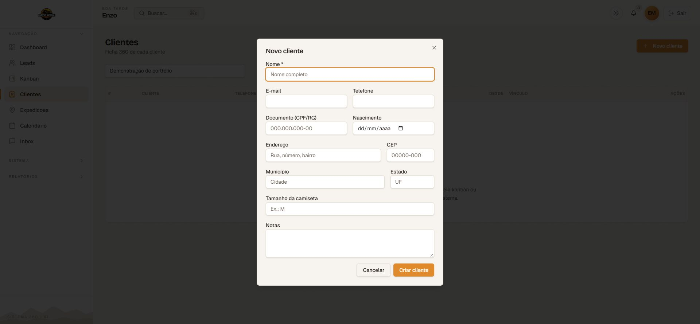
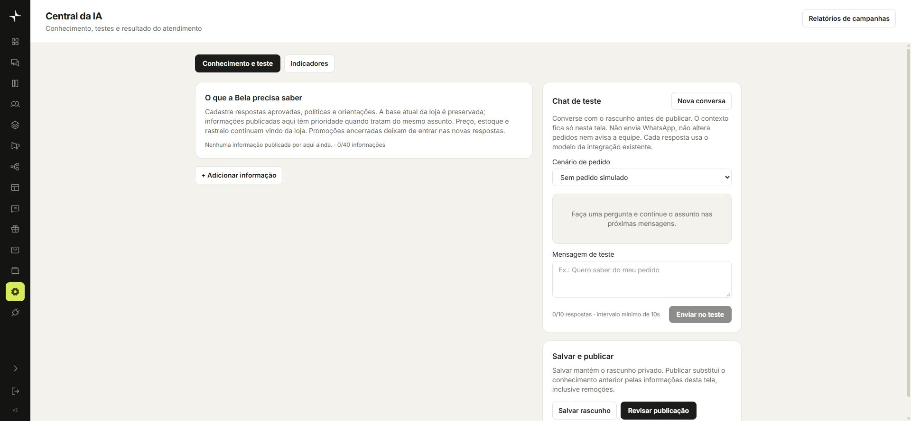

# Enzo Tortelli Mendes

**Desenvolvedor Full Stack | Sistemas, integrações e produtos web**

Construo aplicações que conectam atendimento, operações, dados e serviços externos. Atuo da landing page ao sistema completo: interface, APIs, banco de dados e automações.

[LinkedIn](https://www.linkedin.com/in/enzotortellimendess/) · [E-mail](mailto:mrn95me@gmail.com)

## Habitat Natural — CRM, reservas e integrações financeiras

Desenvolvi do zero uma plataforma para viagens e expedições que reúne leads, CRM, reservas, contratos e financeiro. O escopo inclui **Bradesco Pix, Sicredi, Asaas e ZapSign**, além de PostgreSQL, Redis e filas para tarefas em segundo plano.

[Ver meu estudo de caso](https://github.com/enzotmendes/habitat-natural-portfolio) · [Conhecer a Habitat Natural](https://www.habitatnatural.com.br/)

## Belas Garden — IA aplicada ao atendimento

Evoluí um CRM multicanal já em desenvolvimento. Trabalhei na assistente de vendas Bela, na central de conhecimento e nas integrações com OpenAI, WhatsApp, Instagram e Nuvemshop.

[Ver meu estudo de caso](https://github.com/enzotmendes/belas-garden-portfolio)

## Mais projetos

| Projeto | O que conecta | Minha atuação |
| --- | --- | --- |
| [TRCK Hub](https://github.com/enzotmendes/trck-hub-portfolio) | Marketplaces, Tiny ERP, pedidos, custos e margens | Desenvolvimento do zero |
| [Popozuda Hub](https://github.com/enzotmendes/popozuda-hub-portfolio) | Canais de venda, Bling, Appmax e indicadores de e-commerce | Desenvolvimento do zero |

## Projetos com código público

- [MG-HUB](https://github.com/enzotmendes/MG-HUB): CRM de marketing de influência com campanhas, briefings com IA, contratos e portal do influenciador.
- [Criativos Hub](https://github.com/enzotmendes/MARKETING-SCRAPPING): coleta, transcrição e análise de conteúdo com Python, FastAPI, TypeScript e IA.

Habitat Natural, Belas Garden, TRCK Hub e Popozuda Hub são estudos de caso sem código proprietário. Nos dois repositórios desta seção, é possível explorar a implementação.

**Tecnologias principais:** TypeScript, React, Next.js, Node.js, Python, FastAPI, PostgreSQL, Supabase, Redis, APIs REST e webhooks. Português nativo e inglês fluente.

Esses projetos foram desenvolvidos na empresa. Os estudos de caso mostram minha participação e interfaces sem dados de clientes; o código privado permanece protegido. Não atribuo resultados financeiros sem medição documentada.

## Vamos conversar?

Precisa de um sistema, integração, aplicação Full Stack ou landing page? [Fale comigo pelo LinkedIn](https://www.linkedin.com/in/enzotortellimendess/) ou [envie um e-mail](mailto:mrn95me@gmail.com).
