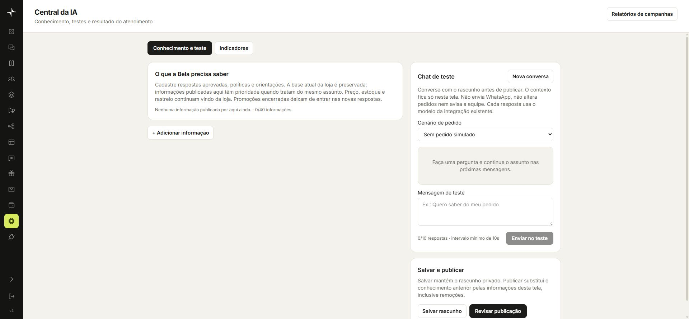

# Belas Garden

**CRM multicanal com inteligência artificial conectada ao atendimento e ao e-commerce.**

## Minha participação

Entrei com o projeto já em desenvolvimento e dei continuidade à implementação e à evolução de suas funcionalidades. Não apresento o sistema como uma criação inteiramente minha. O código-fonte da empresa permanece privado.

## Problema abordado

O atendimento precisa relacionar conversas, informações da loja e acompanhamento comercial. A aplicação reúne esses recursos em um CRM e oferece uma assistente de vendas com IA.

## IA aplicada

- Assistente Bela com integração à OpenAI.
- Central de conhecimento para respostas aprovadas, políticas e orientações da equipe.
- Chat de teste com cenários de pedido simulado antes da publicação de alterações.
- Separação entre rascunho e publicação do conhecimento.

A interface da central informa que o chat de teste não envia WhatsApp, não altera pedidos e não avisa a equipe. Para a captura, nenhuma mensagem de teste foi enviada e nenhuma configuração foi salva ou publicada.

## Integrações e tecnologias

| Camada | Tecnologias e serviços |
| --- | --- |
| Inteligência artificial | OpenAI |
| Atendimento | WhatsApp, Evolution API e Instagram/Meta |
| E-commerce | Nuvemshop |
| Dados | Supabase/PostgreSQL e Redis |
| Frontend | Next.js, React e TypeScript |
| Backend | Python e FastAPI |

O sistema também reúne conversas, kanban, clientes, segmentos, campanhas, automações, pedidos e relatórios. A presença desses módulos não atribui a mim autoria individual sobre cada um deles.

## Demonstração da interface

Captura real da central de IA, sem conversas de clientes, dados de pedidos ou credenciais.

## Resultado apresentado

Integração de atendimento, dados de e-commerce e recursos de IA em uma aplicação de gestão. A central de conhecimento e o ambiente de testes foram verificados na interface, sem executar ações sobre clientes.

Não são apresentados índices de conversão, redução de tempo ou produtividade sem medição documentada.

[Perfil de Enzo Tortelli Mendes](https://github.com/enzotmendes)
